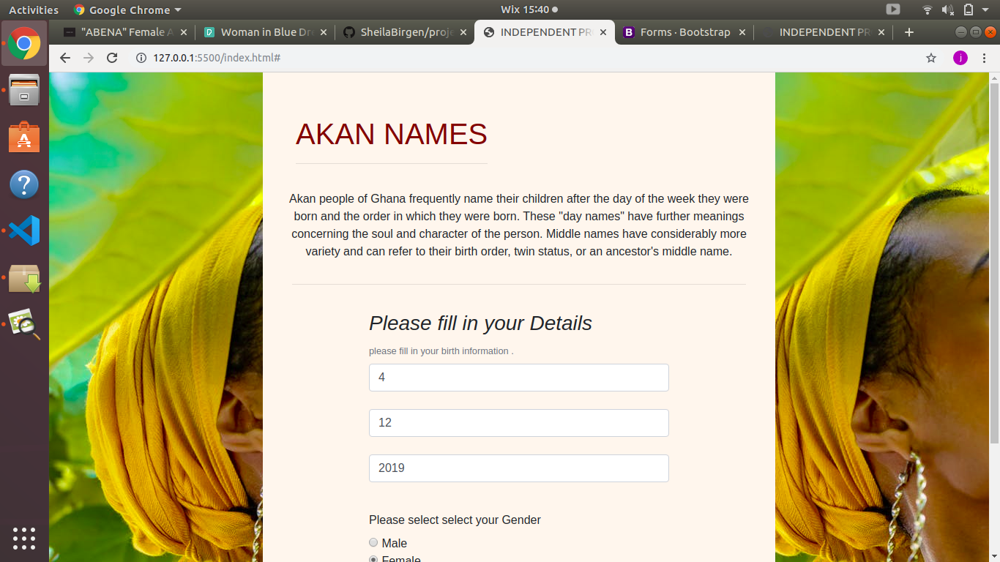

# AKAN NAMES WEBPAGE.

## Project author

Sheila Birgen J.

## Screenshot

## Description

This is a webpage that details about me as a software developer,My educational background and my hobbies.

## Deploying link

## BDD

On visiting the website the home page displays a form which has a brief introduction on the Akan naming.You'll be required to enter your birth details and your gender in order to know your Akan name and the day you were born.

## Technologies used

    HTML
    CSS
    JAVASCRIPT
    BOOTSTRAP

## Known Bugs

As at now there is no known bug

## Support and contact details

For any comment question or feedback reach me through this email jeronobergen@gmail.com

## Licence

MIT License

Copyright (c) 2019 SheilaBirgen

Permission is hereby granted, free of charge, to any person obtaining a copy
of this software and associated documentation files (the "Software"), to deal
in the Software without restriction, including without limitation the rights
to use, copy, modify, merge, publish, distribute, sublicense, and/or sell
copies of the Software, and to permit persons to whom the Software is
furnished to do so, subject to the following conditions:

The above copyright notice and this permission notice shall be included in all
copies or substantial portions of the Software.

THE SOFTWARE IS PROVIDED "AS IS", WITHOUT WARRANTY OF ANY KIND, EXPRESS OR
IMPLIED, INCLUDING BUT NOT LIMITED TO THE WARRANTIES OF MERCHANTABILITY,
FITNESS FOR A PARTICULAR PURPOSE AND NONINFRINGEMENT. IN NO EVENT SHALL THE
AUTHORS OR COPYRIGHT HOLDERS BE LIABLE FOR ANY CLAIM, DAMAGES OR OTHER
LIABILITY, WHETHER IN AN ACTION OF CONTRACT, TORT OR OTHERWISE, ARISING FROM,
OUT OF OR IN CONNECTION WITH THE SOFTWARE OR THE USE OR OTHER DEALINGS IN THE
SOFTWARE.
